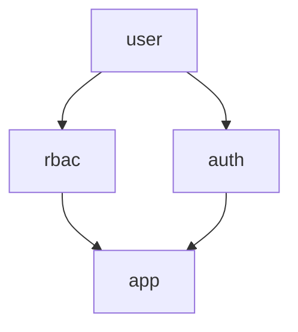

# tinywasm/rbac


Role-based authorization runtime for TinyWasm applications. Authentication and
sessions belong to `tinywasm/auth`. Both are siblings that depend only on
`tinywasm/user` and never on each other.

> **BREAKING CHANGE**: `DeleteRole` now returns `rbac.ErrRoleNotFound` when attempting to delete a non-existent role, instead of returning `nil`.
>
> **BREAKING CHANGE**: `GetRoleByCode` now returns `rbac.ErrRoleNotFound` (not `orm.ErrNotFound`) when the code doesn't exist in the project, and `rbac.ErrDuplicateRoleCode` if more than one row matches (should not happen after the unique index, but is now reported instead of silently picking one). Any caller comparing `err == orm.ErrNotFound` after `GetRoleByCode` must switch to `err == rbac.ErrRoleNotFound` — the code still compiles either way, so this fails silently at runtime (a 500 where a 404 used to be), not at compile time.




## Documentation

- [Architecture](docs/ARCHITECTURE.md) — Dependency rules and authorization mechanics

## Usage

Every table — and every call — carries a `projectID`: one `Service` over one
database serves every consuming project (`misitio`, `mjosefa-cms`, ...)
without their roles/permissions colliding or leaking into each other.

Schema reconciliation (`rbac.Migrate`) is performed once at deploy time, not inside `rbac.New`:

```go
import (
    "github.com/tinywasm/rbac"
    "github.com/tinywasm/model"
    "github.com/tinywasm/orm"
    "github.com/tinywasm/sqlite"
    "github.com/tinywasm/sqlt"
)

conn, _ := sqlite.Open("app.db")
_ = rbac.Migrate(conn, sqlt.NewCompiler())

db := orm.New(conn)
svc, _ := rbac.New(db)

const projectID = "misitio"

_ = svc.CreateRole(projectID, "role_admin", "admin", "Administrator", "")
_ = svc.CreatePermission(projectID, "service_catalog:crud", "catalog", "service_catalog", model.AllActions)
_ = svc.AssignPermission(projectID, "role_admin", "service_catalog:crud")
_ = svc.AssignRole(projectID, string(subjectID), "role_admin")

if svc.Can(projectID, string(subjectID), "service_catalog", model.Read) {
    // granted
}
```

Empty or unknown subject IDs are denied — rbac never persists a "user" row,
so a subject with no assignments simply resolves to zero permissions, not
an error. Malformed stored actions deny and surface an error (never a
silent `false, nil`).

## API — Quiero X → Uso Y

| Objetivo | Método |
|---|---|
| Asignar rol por código | `svc.AssignRoleByCode(projectID, userID, roleCode)` |
| Revocar rol por código (invalida caché) | `svc.RevokeRoleByCode(projectID, userID, roleCode)` |
| Listar usuarios de un rol | `svc.UsersInRole(projectID, roleCode)` |
| Contar usuarios de un rol | `svc.RoleUserCount(projectID, roleCode)` |
| Eliminar rol y asignaciones por código | `svc.DeleteRoleByCode(projectID, roleCode)` |
| Detectar roles duplicados antes de migrar | `rbac.FindDuplicateRoleCodes(db)` |
