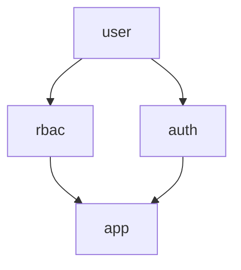

# tinywasm/rbac


Role-based authorization runtime for TinyWasm applications. Authentication and
sessions belong to `tinywasm/auth`. Both are siblings that depend only on
`tinywasm/user` and never on each other.



## Documentation

- [Architecture](docs/ARCHITECTURE.md) — Dependency rules and authorization mechanics

## Usage

```go
import (
    "github.com/tinywasm/rbac"
    "github.com/tinywasm/model"
    "github.com/tinywasm/orm"
    "github.com/tinywasm/sqlite"
)

conn, _ := sqlite.Open("app.db")
db := orm.New(conn)
svc, _ := rbac.New(db)

_ = svc.CreateRole("role_admin", "admin", "Administrator", "")
_ = svc.CreatePermission("service_catalog:crud", "catalog", "service_catalog", model.AllActions)
_ = svc.AssignPermission("role_admin", "service_catalog:crud")
_ = svc.AssignRole(string(subjectID), "role_admin")

if svc.Can(string(subjectID), "service_catalog", model.Read) {
    // granted
}
```

Empty or unknown subject IDs are denied; malformed stored actions surface
`EventPermissionCorrupt` and deny.
