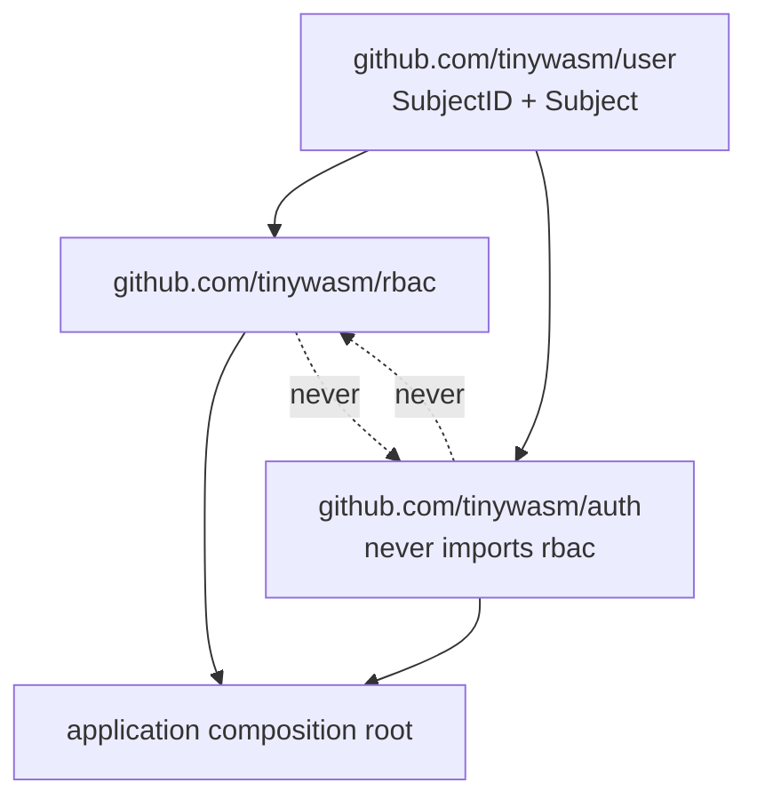
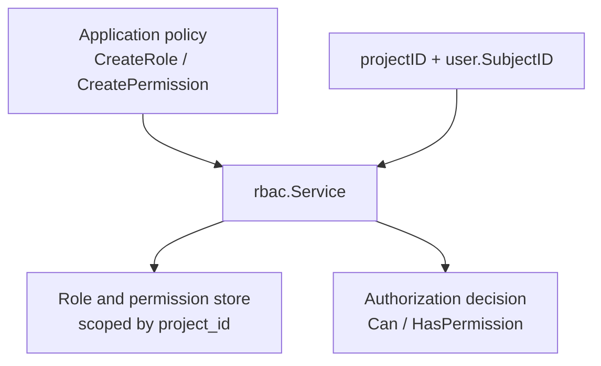

# Architecture

`tinywasm/rbac` owns role, permission, assignment, and authorization decision
mechanics. Assignments are keyed by `user.SubjectID`; this module does not know
how subjects authenticate or how sessions are transported.

Applications declare policy by creating roles and grants, then inject
`rbac.Service.Can` into their router. `rbac` never imports `tinywasm/auth`;
`auth` never imports `rbac`. Both depend only on `tinywasm/user`.

## Dependency Direction

Rules:

- `user` imports neither sibling.
- `rbac` imports `user` and may depend on `orm`, `ddl`, `model`, `input`.
  It never imports `auth` or a concrete provider.
- Only the composition root imports both `auth` and `rbac`.

## Setup & Database Migration

Schema reconciliation (`rbac.Migrate`) is deploy-time work and is deliberately NOT called by `rbac.New`.
Run `rbac.Migrate(conn, compiler)` once from a migration script or deploy task, then let `rbac.New(db)` assume the schema already exists.

## Concepts

- **Roles** have a project ID, an ID, code, name, description.
- **Permissions** have a project ID, an ID, resource, and action string (`crud` letters).
- **Assignments** via `UserRole` and `RolePermission` are keyed by
  `project_id` + `SubjectID` string (`user_id` column) + role/permission IDs.
- **Policy belongs to the consumer**: `Register` builds permissions from the
  app's `RBACObject` handlers; no role or resource constants live here.

Cache invalidation is encapsulated in the service: mutations delete or
invalidate the per-`(projectID, subjectID)` cache entry. Empty or unknown
`SubjectID` is denied — there is no "user" row to look up, only assignments
that may or may not exist; a malformed stored `action` denies and surfaces
an error, never a silent `false, nil`.

## Multi-project by `project_id` — every table, every query

One `Service` over one database serves every consuming project. `Role`,
`Permission`, `UserRole`, and `RolePermission` all carry `project_id` as
part of their primary key, and every method on `Service` takes `projectID`
as its first argument. Two projects can each declare a role with the same
natural id (`"role_admin"`) without colliding — see
[`TestProjectsAreIsolated`](../tests/rbac_test.go), the test this property
exists for.

References between these four tables are **soft** (plain string columns,
no DB-managed foreign key): `rbac` never imports a project's own domain
types, and a composite FK across `(project_id, id)` is not worth the
complexity here. Referential integrity for a soft reference is the
caller's responsibility, same as `user_id` always was.

## No "user" table

`rbac` never persists a subject's identity — no email, name, or any column
beyond what `UserRole`/`RolePermission` need to resolve a decision. A
`(projectID, subjectID)` pair that never received an `AssignRole` simply
resolves to empty roles/permissions; there is nothing to look up and
nothing that can 404. This was not always true: a pre-split vestige kept a
full duplicate of `tinywasm/auth`'s user-management code here (`CreateUser`,
`GetUser`, `hydrateUser`, ...), removed once its only real caller
(`HasPermission`) was rewritten to resolve grants directly from
`UserRole`/`RolePermission` instead of reading a `User` row first.

## `id` y `code`: dos identidades, un rol

Cada rol posee dos identificadores:
- `id`: clave primaria de almacenamiento (e.g. `role_123`), utilizada internamente para las uniones en tablas de enlace (`user_role`, `role_permission`).
- `code`: vocabulario público y natural usado por las aplicaciones consumidoras (e.g. `admin`, `editor`).

Dentro de un mismo proyecto (`project_id`), el par `(project_id, code)` debe ser único. Permitir dos roles con el mismo `code` en un proyecto generaba comportamientos ambiguos: `GetRoleByCode` devolvía un rol arbitrario y borrar el rol desde la interfaz administrativa borraba solo una instancia, dejando la otra activa con sus usuarios asignados y manteniendo accesos revocados en apariencia.

## El caché y por qué no se borra a mano

El servicio mantiene un caché en memoria (`ucache`) para acelerar la resolución de permisos (`HasPermission` / `Can`). Cuando se otorgan o revocan roles y permisos a través de los métodos typed del servicio (`AssignRoleByCode`, `RevokeRoleByCode`, `DeleteRoleByCode`, `DeleteRole`), el caché invalida las entradas del usuario o rol correspondiente de forma automática.

**Antipatrón a evitar:** Eliminar filas directamente con la base de datos (e.g., `db.Delete(&rbac.UserRole{}, ...)`). Saltearse los contratos expuestos por `Service` evita la invalidación de `ucache`, provocando que los permisos supuestamente revocados continúen concediéndose desde la memoria hasta la expiración o desalojo FIFO del caché.
