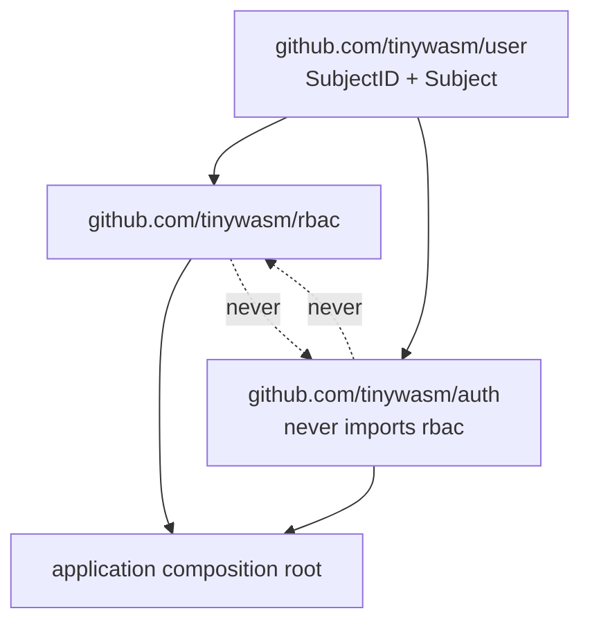
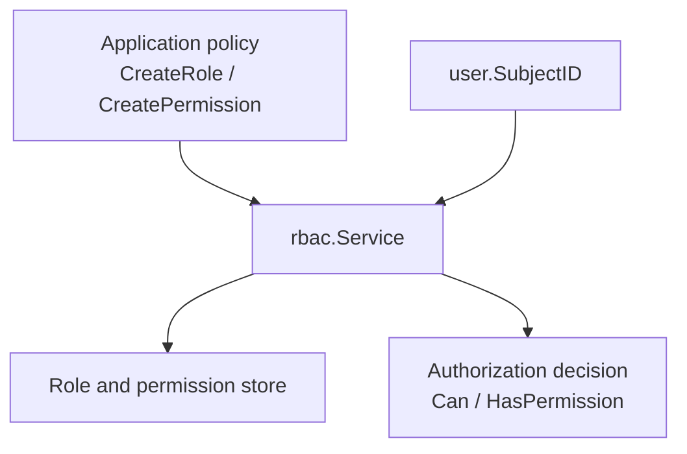

# Architecture

`tinywasm/rbac` owns role, permission, assignment, and authorization decision
mechanics. Assignments are keyed by `user.SubjectID`; this module does not know
how subjects authenticate or how sessions are transported.

Applications declare policy by creating roles and grants, then inject
`rbac.Service.Can` into their router. `rbac` never imports `tinywasm/auth`;
`auth` never imports `rbac`. Both depend only on `tinywasm/user`.

## Dependency Direction

Rules:

- `user` imports neither sibling.
- `rbac` imports `user` and may depend on `orm`, `ddl`, `model`, `input`.
  It never imports `auth` or a concrete provider.
- Only the composition root imports both `auth` and `rbac`.

## Concepts

- **Roles** have an ID, code, name, description.
- **Permissions** have an ID, resource, and action string (`crud` letters).
- **Assignments** via `UserRole` and `RolePermission` are keyed by
  `SubjectID` string (`user_id` column) and role/permission IDs.
- **Policy belongs to the consumer**: `Register` builds permissions from the
  app's `RBACObject` handlers; no role or resource constants live here.

Cache invalidation is encapsulated in the service: mutations delete or
invalidate the per-subject cache. Empty or unknown `SubjectID` is denied; a
malformed stored `action` denies and surfaces `EventPermissionCorrupt`.
